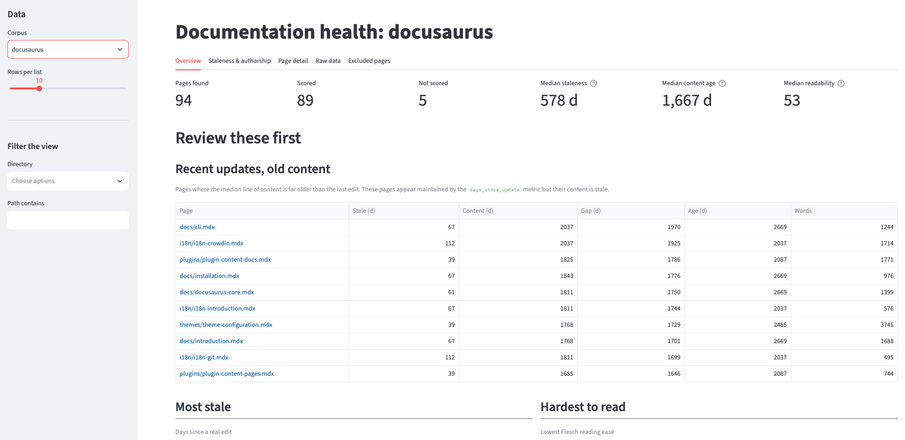

# dochealth

Per-page documentation health metrics for docs-as-code repositories.

<div className="margin-bottom--md">
  <a className="button button--primary margin-right--sm" href="https://dochealth.streamlit.app/">Open the live dashboard</a>
  <a className="button button--secondary" href="https://github.com/christopher-marshall/dochealth">View the source on GitHub</a>
</div>



## The problem

Documentation teams usually judge freshness by a page's last-modified date. That
date is easy to move without improving anything: a typo fix, a link update, or a
repository-wide formatting commit all make an old page appear well maintained.

I wanted to know which pages in a docs set actually require attention,
using information readily available to any docs-as-code repo: the Git history and
the prose itself.

## What it does

Point dochealth at a docs repo and it walks every `.md`
and `.mdx` page, reads the history and the text, and writes one CSV row per
page. A Streamlit dashboard reads those CSVs back.

For each page it reports:

| Question | Metric |
|---|---|
| When was this page last really edited? | Days since the last commit that changed lines, with housekeeping commits filtered out |
| How old is the content itself? | Age of the page's median line, from `git blame` |
| Has it changed since it was written? | Ratio of staleness to page age |
| How hard is it to read? | Flesch reading ease, computed on reader-visible prose only |
| What kind of page is it? | Word count, code-block density, and heading structure |
| Who maintains it? | Commit and author counts |

Pages that are too thin to judge, such as navigation stubs, are listed
separately instead of being scored.

## What I found

I ran it against two public docs sets: the Kubernetes concept pages (176 pages)
and the Docusaurus documentation (94 pages).

- **Pages that look maintained and aren't.** The Kubernetes page
  `replicationcontroller.md` was edited 95 days before extraction. Its median
  line was 3,422 days old.
- **One housekeeping commit hid years of staleness.** A single `chore:` commit
  made 7 of 8 Docusaurus guide pages look 158 days old. Their last real content
  edit was up to 1,033 days earlier.
- **Many poorly maintained pages are easy to overlook.** Staleness and readability rankings 
  bury some pages because they don't score badly enough on either score individually. I set up a ratio 
  to surface those pages that are in the lowest 25% of both staleness and reading difficulty.
- **Readability scores measure markup unless you stop them.** One Kubernetes
  page scored −29 because leftover HTML formed a single 5,761-character
  "sentence". With the HTML stripped, the same page scores 34.6.
- **A single health score can't compare docs sets.** Two unrelated corpora both
  averaged about 0.42, because percentile ranks fix the mean by construction.

## Why there is no health score

The obvious design is one number per page, or even one number scoring the 
entire docs site. I built this, then decided against it.

The weights behind a composite score couldn't be justified by the data. Too 
many metrics cross-correlated and the few truly independent metrics didn't 
say enough about the health of the docs set to warrant the score. 
Averaging percentile ranks also produced the same mean for every corpus, 
so the number said nothing about how one docs set compared with another.

dochealth is a measuring instrument instead of a grader. It scores two things,
staleness and readability; shows them separately; and presents everything else
as context. The full reasoning, including the approaches I tried and deleted, is
in [DECISIONS.md](https://github.com/christopher-marshall/dochealth/blob/main/DECISIONS.md).

## The dashboard

The [live dashboard](https://dochealth.streamlit.app/) has five tabs:

- **Overview**: the pages to review first, and readability against the published Flesch bands.
- **Staleness & authorship**: every page plotted against its own lifetime.
- **Page detail**: one page's metrics placed against the rest of the corpus.
- **Raw data**: the full table.
- **Excluded pages**: the pages that were not scored, with a reason for each.

Filters narrow what you look at, never what a page is measured against.
Percentiles are always computed over the whole corpus.

## How it's built

- **Python** package with a command-line interface (`dochealth extract` and `dochealth dashboard`).
- **Git** (`git log` and `git blame`) as the data source for every history metric.
- **pandas** for the per-page table and **textstat** for readability.
- **Streamlit** and **Altair** for the dashboard, deployed on Streamlit Community Cloud.
- **pytest** for the parsers, the scoring rules, and the dashboard itself, plus
  an end-to-end check against a real clone.

```bash
dochealth extract website content/en/docs/concepts \
    --config kubernetes_config.py --out metrics-kubernetes.csv
dochealth dashboard
```

## Links

- [Live dashboard](https://dochealth.streamlit.app/)
- [Source code](https://github.com/christopher-marshall/dochealth)
- [Design decisions](https://github.com/christopher-marshall/dochealth/blob/main/DECISIONS.md)
